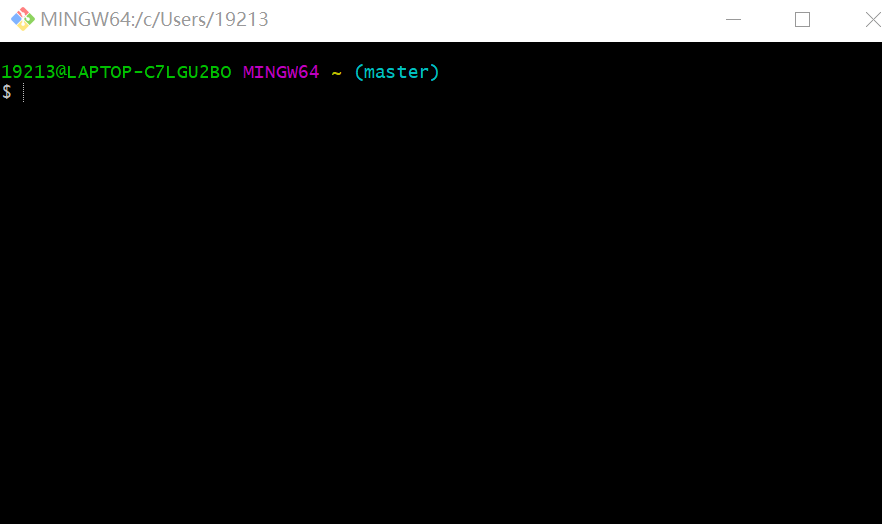
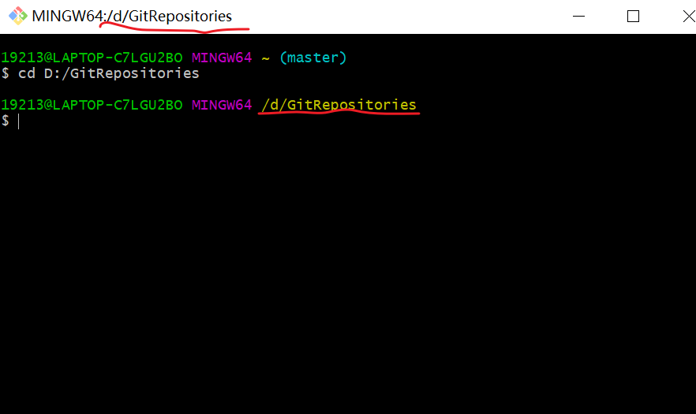
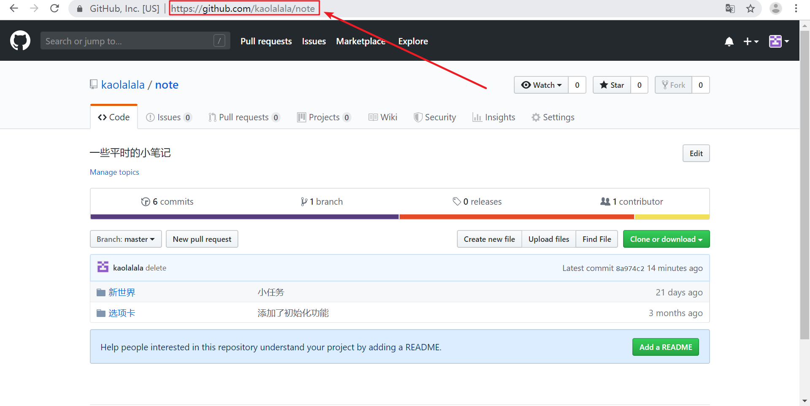
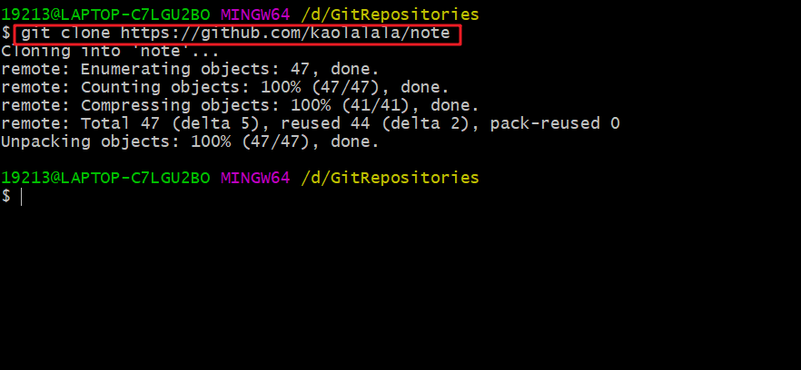
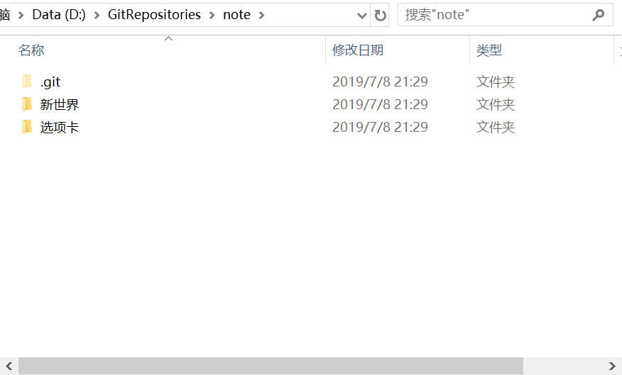
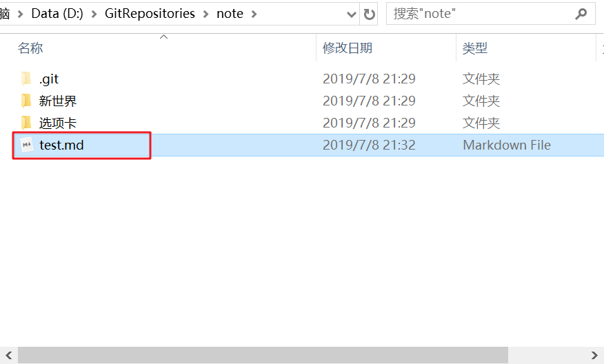
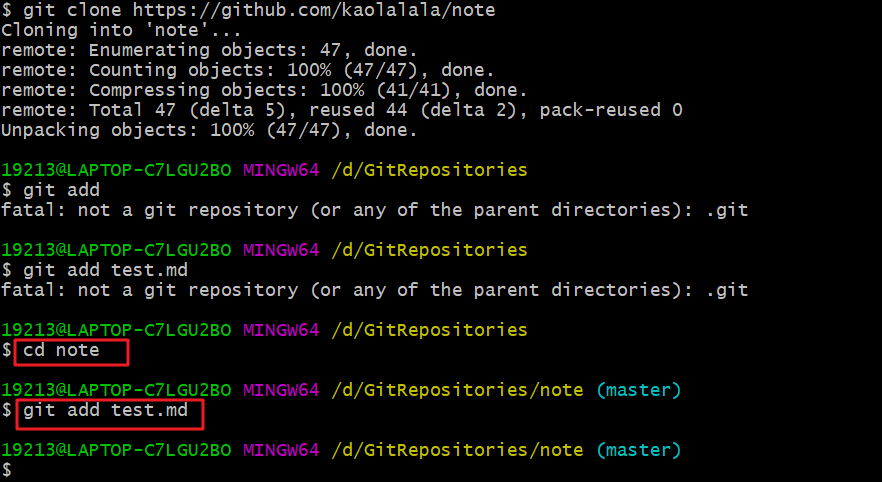
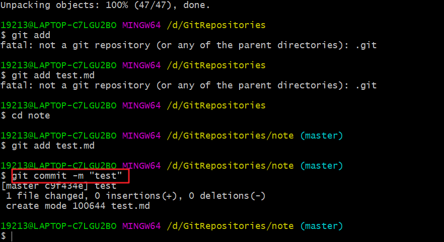
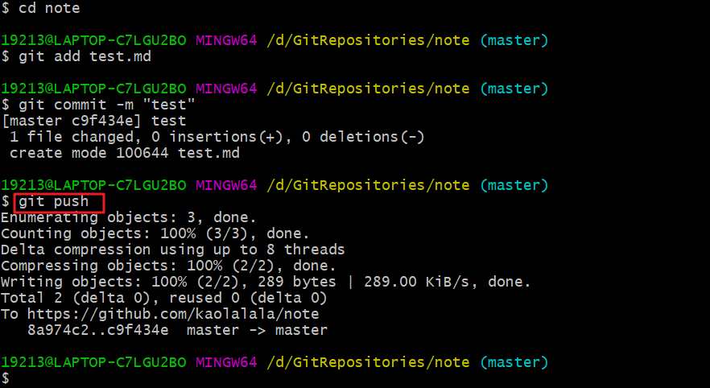
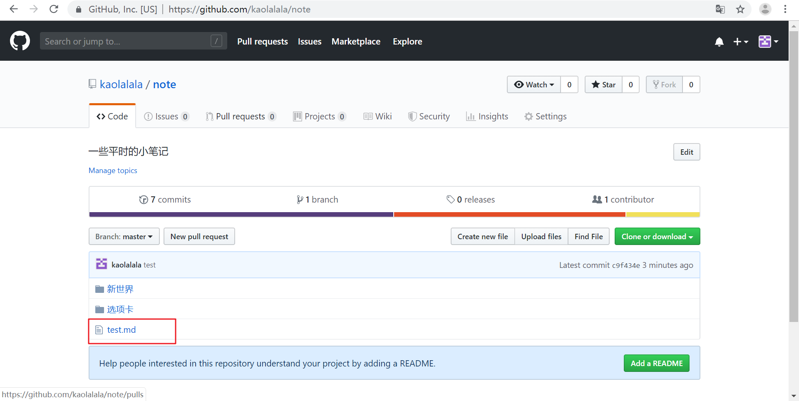

# 初步学习Git（一）

- 基础

  在之前我就已经学了几句简单的有关git的命令行，这里把我之前会的做一下介绍

  - `git clone <url> `**克隆远程仓库**

    这里的url指的是某个仓库的网址。

    例如https://github.com/kaolalala/note

    输入`git clone <https://github.com/kaolalala/note>`

    就能把github网上的远程仓库克隆（我的理解就是下载）到自己的本地电脑上。在这里还有一个步骤，就是先决定好要把这个仓库克隆到电脑的具体哪个位置，比如C盘或D盘。在一开始安装好git的时候，电脑里就会带有一个Git Bash的软件，打开是一个黑窗口，如下图

    

    这里的话默认所在位置是C盘，我个人习惯于把文件存放于D盘并且为从GitHub上面克隆的仓库创建了一个文件夹，所有这里我先把位置定到那个文件夹中。

    执行`cd D:/GitRepositories`

    意思就是打开D盘中的GitRepositories文件夹。

    

    可以看一下画红线的地方与上图做对比，发现执行完那条指令之后就能看到黄色字体处显示了目前所在位置。这里`D:/GitRepostories`表示的是所要打开文件夹与在输入这条指令时当前所在文件夹的相对位置，也可以分开成两次打开，一次打开一个或多个，主要是要掌握文件路径的写法，可以搜索一下**绝对路径**和**相对路径**了解一下。例如上面那条指令就可以分为`cd D:`

    和`cd Repositories`。

    > 补充一点，就是我这个状态是已经登陆了自己的GitHub账号在git bash了。之前装的时候登陆过一次，后来每次打开就都是这个状态，账号登陆着对于后续进行对github远程仓库的克隆，修改等操作都比较方便，由于太久了我也忘了当时是怎么登陆的，如果想要了解可以到网上搜索Git安装登陆等教程，这里无法做出详尽解释请见谅。

    现在，我已经打开了我的目标文件夹，下一步就是把目标仓库克隆到我的所在文件夹里，执行`git clone <url>`的命令，例如我现在要把最开始所说的那个仓库克隆下来，就先在网页上打开这个仓库的网址，然后复制网址带入上面的url中，

    

    这么做的目的是让你准确的把网址复制下来，如果你能准确打出这个网址，那么直接输入也没关系。

    

    克隆成功之后你就能在你的文件夹里看到有一个叫做note的新文件夹，这就是你克隆到本地的仓库，打开之后就能发现之前在网页上看到的仓库里的文件都在里面。

    

    这就是克隆成功了。

  - `git add 文件名`和`git commit -m "注释"`

    这两个操作用来保存你对于本地文件的修改，便于上传到远程仓库。

    `git add`后面加的文件名就是被你修改过的文件或者文件夹，可以添加一个或多个，执行完后一般不会有提示，那就表示没问题。如

    

    现在我较之前添加了一个新的叫做`test.md`的文件，我要把它上传到远程仓库就得先进行`git add`的指令，如果还有别的文件想要添加，则再加一句`git add 文件名`的指令，多个也是。（这里不只是添加才会用到这句指令，其他的修改比如修改文件内容或者删除文件也是用这条指令，如删除就用`git add 所删除的文件`）。

    

    记得克隆之后要打开克隆的那个仓库文件夹才能对里面的文件进行操作，否则会报错。

    操作完`git add`之后，执行`git commit -m "注释"`，注释的信息是对你本次提交内容的说明，这对于你之后版本回退等操作有很大的帮助。

    

    `git commit`之后会显示本次所修改的信息。

  - `git push` 把本地仓库的修改同步到远程仓库

    

    `git push`之后重新回到网页，会发现多了一个叫`test.md`的文件，说明修改成功。

    

- 以上就是今天想总结的内容，我对于GitHub于git其实了解还不是很深，故而有些地方说的可能并不准确，请见谅，也欢迎指正。